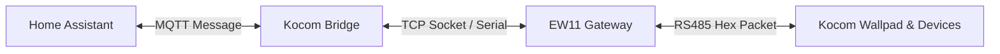

# System Architecture (MQTT - RS485 Bridge)

이 문서는 코콤 월패드 RS485 통신과 Home Assistant(HA) MQTT 간의 데이터 흐름 및 전체적인 아키텍처를 설명합니다.

---

## 1. 개요 (Overview)

이 프로젝트는 월패드의 RS485 통신 라인(EW11 등 Wifi to RS485 게이트웨이 경유)을 모니터링하여 가전기기의 상태를 Home Assistant로 전송하고, 반대로 Home Assistant에서 내려오는 제어 명령을 RS485 패킷으로 변환하여 기기들을 제어하는 **MQTT-RS485 브릿지** 역할을 합니다.

---

## 2. 주요 구성 요소 (Key Components)

- **[RS485](../src/kocom/rs485.py#L22) 클래스**
  - 설정 파일(`rs485.conf`)을 읽어 시리얼(Serial) 포트 또는 TCP 소켓(Socket)을 연결하고 관리합니다.
- **[Kocom](../src/kocom/core.py#L68) 클래스**
  - 이 프로젝트의 코어 모듈입니다.
  - MQTT 연결과 RS485 송수신 스레드를 구동하고, 양방향 메시지 변환 및 상태 관리를 전담합니다.
- **디바이스 모델 및 빌더 ([Light](../src/kocom/devices/light.py) / [Plug](../src/kocom/devices/plug.py) / [Thermostat](../src/kocom/devices/thermostat.py) 등)**
  - 각 기기별 프로토콜 사양에 맞춰 수신된 Hex 패킷을 의미 있는 상태 값으로 디코딩하거나, HA의 제어 명령을 RS485 Hex 패킷으로 조립(Build)합니다.

---

## 3. 핵심 데이터 흐름 (Data Flow)

### 3.1. RS485 ➡️ Home Assistant (상태 모니터링)

1. **패킷 모니터링 스레드 (`_t1` / [get_serial](../src/kocom/core.py#L496))**
   - 시리얼/소켓 연결로부터 유입되는 바이트 스트림을 실시간으로 읽어 들입니다.
   - Kocom 헤더(`aa`)가 수집되면, 지정된 패킷 길이만큼 데이터를 모아 체크섬을 검증합니다.
2. **패킷 파싱 ([packet_parsing](../src/kocom/core.py#L594))**
   - 수신 완료된 패킷에서 목적지(Destination), 출발지(Source), 명령(Command), 제어 대상, 상태 값 등을 분석합니다.
   - 분석된 정보는 내부 상태 관리자(`self.wp_list`)에 업데이트됩니다.
3. **HA 전송 ([publish_state_to_ha](../src/kocom/core.py#L463))**
   - 기기의 상태 업데이트가 있으면 JSON 형태로 가공하여 미리 정의된 HA 상태 토픽으로 MQTT 메시지를 발행(Publish)합니다.
   * **예시 토픽:** `homeassistant/light/livingroom/state`
   * **예시 페이로드:** `{"state": "on"}`

---

### 3.2. Home Assistant ➡️ RS485 (기기 제어)

1. **제어 명령 수신 ([on_message](../src/kocom/core.py#L278) & [parse_message](../src/kocom/core.py#L330))**
   - Home Assistant 대시보드나 자동화 규칙에 의해 기기 제어가 트리거되면, HA는 MQTT 제어 토픽으로 메시지를 발행합니다.
   - 브릿지는 이를 구독(Subscribe)하고 있다가 이벤트를 수신합니다.
2. **목표 상태 기록**
   - 수신한 명령 토픽과 페이로드(예: `on`/`off`, 설정 온도 등)를 확인하고, `self.wp_list`에 해당 기기의 목표 제어 값(`set_val`)을 기록합니다.
3. **주기적 스캔 및 패킷 전송 스레드 (`_t2` / [scan_list](../src/kocom/core.py#L718))**
   - 백그라운드 스레드에서 주기적으로 전체 기기 상태를 스캔하며, HA가 설정한 목표 제어 값(`set_val`)과 실제 기기 상태(`state`)에 차이가 있는지 감시합니다.
   - 차이가 발견되면 [set_serial](../src/kocom/core.py#L732)을 호출합니다.
   - 각 기기 클래스는 전략 패턴과 빌더 패턴을 사용해 해당 조작 명령에 부합하는 **RS485 Hex 패킷**을 생성합니다.
   - 최종적으로 `self.write(packet)`를 통해 EW11(시리얼/소켓)로 데이터를 내보냅니다.

---

## 4. HA MQTT Discovery (자동 기기 등록)

브릿지 실행 초기 혹은 HA 상태 변경 시 [publish_ha_discovery](../src/kocom/core.py#L437)를 실행합니다.
- 활성화된 기기들로부터 디스커버리 정보를 취합하여 `homeassistant/<component>/<device_id>/config` 토픽으로 MQTT 메시지를 발행합니다.
- 이 정보를 받은 Home Assistant는 별도의 수동 구성 없이 대시보드 및 기기 목록에 월패드 구성 요소를 자동으로 추가합니다.

---

## 5. Kocom vs Grex 비교 (Kocom vs Grex Comparison)

이 프로젝트는 월패드 연동을 위한 `Kocom` 모듈과 전열교환기 연동을 위한 `Grex` 모듈을 모두 포함하고 있으며, 두 모듈은 대상 기기와 통신 방식에서 큰 차이가 있습니다.

### 5.1. 동작 차이 요약

| 구분 | [Kocom 클래스](../src/kocom/core.py#L68) | [Grex 클래스](../src/kocom/core.py#L868) |
| :--- | :--- | :--- |
| **제어 대상** | 조명, 플러그, 보일러, 가스, 엘리베이터 등 | 그렉스 전열교환기(환기 장치) |
| **연결 방식** | 단일 회선 (RS485 Bus 접속) | 이중 회선 (벽 조절기 ↔ 브릿지 ↔ 환기 장치) |
| **작동 메커니즘** | 게이트웨이 / 브릿지 | 중간 패킷 변조 및 전달 (Proxy / MITM) |
| **상태 스캔** | 필요 (`scan_list` 폴링 루프 동작) | 불필요 (양방향 실시간 수집 패킷 이용) |

### 5.2. Grex의 프록시(Proxy) 작동 방식

그렉스 환기 시스템은 **벽 조절기(Controller)**와 **천장 환기 유닛 본체(Ventilator)** 간의 통신 선을 잘라 브릿지의 독립된 두 시리얼 포트에 각각 연결하여 중간자(MITM) 형태로 패킷을 가로채고 전달합니다.

- **벽 조절기 수신:** 벽 조절기에서 속도 변경 등의 명령(`d08a` 패킷)이 오면 수집하여 HA에 알리고, 조절기에는 가짜 응답 패킷(`response_packet`)을 보내 오동작을 방지합니다.
- **환기 본체 제어:** 가로챈 조작 명령에 부합하는 실제 제어 패킷(`control_packet`)을 조립하여 환기 유닛 본체로 직접 발행합니다.
- **실시간 상태 동기화:** 벽 조절기와 환기 유닛 본체가 항상 실시간으로 통신 상태 패킷(`d08a`, `d18b`)을 활발히 전송하므로, Kocom처럼 강제로 상태를 캐묻는 폴링 루프(Scan)를 타지 않고도 정확한 기기 상태를 동기화할 수 있습니다.
