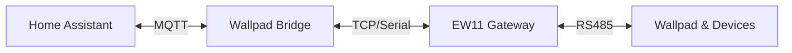

# System Architecture (MQTT - RS485 Bridge)

이 문서는 코콤 월패드 RS485 통신과 Home Assistant(HA) MQTT 간의 데이터 흐름 및 전체적인 아키텍처를 설명합니다.

---

## 개요 (Overview)

이 프로젝트는 월패드의 RS485 통신 라인(EW11 등 Wifi to RS485 게이트웨이 경유)을 모니터링하여 가전기기의 상태를 Home Assistant로 전송하고, 반대로 Home Assistant에서 내려오는 제어 명령을 RS485 패킷으로 변환하여 기기들을 제어하는 **MQTT-RS485 브릿지** 역할을 합니다.

> [!NOTE]
> 하드웨어 물리 결선 방식(소켓/시리얼, 버스/프록시 토폴로지)에 대한 상세한 가이드는 [하드웨어 연결 가이드](hardware_connection.md) 문서에서 다룹니다.

브릿지는 단일 asyncio 이벤트 루프 위에서 동작합니다. `main()`이 `Panel`(월패드)과 `Ventilator`(전열교환기)를 초기화하고 각자의 태스크를 생성한 뒤 `asyncio.gather`로 함께 구동합니다. MQTT 콜백만은 paho 라이브러리의 내부 스레드에서 실행되며, 이벤트 루프와의 경계는 `call_soon_threadsafe` / `run_coroutine_threadsafe`로 넘습니다.

---

## 주요 구성 요소 (Key Components)

> **의존성 방향 규칙 (Dependency Rule):**
> 프로젝트의 의존성은 항상 `apps/` 계층에서 인프라(`transport/`, `protocol/`, `mqtt/` 등) 방향으로 단방향으로 흐릅니다. 인프라 계층은 `apps/` 계층의 세부 구현을 알지 못하며 직접 참조해서는 안 됩니다.

### Transport 계층 (`src/wallpad/transport/`)

연결 생성과 비동기 I/O 추상화를 담당합니다. 기기 클래스(`Panel`, `Ventilator`)는 transport를 직접 생성하지 않고, 팩토리 함수가 생성한 인스턴스를 주입받습니다.

- **[`BaseTransport`](../src/wallpad/transport/base.py)** (추상 클래스)
  - 프로젝트 전역에서 사용하는 비동기 I/O 인터페이스. `async connect / read / write / close` 네 메서드를 정의합니다.
  - [`SerialTransport`](../src/wallpad/transport/serial.py) — pyserial 기반 시리얼 포트 구현체
  - [`SocketTransport`](../src/wallpad/transport/socket.py) — TCP 소켓 구현체

- **데코레이터 transport** — `BaseTransport`를 감싸 부가 책임을 더합니다.
  - [`ReconnectingTransport`](../src/wallpad/transport/reconnect.py) — 연결 유실 시 자동 재연결을 담당합니다.
  - [`BusArbitrationTransport`](../src/wallpad/transport/bus_arbitration.py) — RS485 반이중 버스 충돌을 피하기 위해 마지막 버스 활동 시각을 추적합니다. `BaseTransport`에는 없는 `is_idle()` / `write_if_idle()`를 추가로 제공하여, 버스가 정숙할 때만 쓰기를 허용합니다. "언제 재시도할지"는 이 클래스가 아니라 호출자(`StateSynchronizer`)의 몫입니다.

- **[팩토리 함수](../src/wallpad/transport/factory.py)**
  - `create_panel_transport(config)` — 설정의 `comm_type`에 따라 `SerialTransport` 또는 `SocketTransport`를 만들고, `ReconnectingTransport` → `BusArbitrationTransport` 순으로 감싸 반환합니다.
  - `create_ventilator_transports(config)` — Ventilator용 ctrl/unit transport 쌍을 생성합니다. (버스 중재 없이 `ReconnectingTransport`만 적용 — MITM 프록시 구조상 버스 경합이 없습니다.)

### 기기 계층

- **[`Panel`](../src/wallpad/apps/panel/panel.py) 클래스**
  - 이 프로젝트의 코어 모듈입니다.
  - 초기화 시 `BaseTransport`를 주입받아, `start()`에서 두 개의 asyncio 태스크 — RS485 수신 루프(`receive_packets()`)와 상태 동기화 워커(`StateSynchronizer.run()`) — 를 생성합니다.
  - 양방향 메시지 변환과 라우팅을 담당하며, 상태 소유·갱신 규칙과 패킷 조립은
    각 `CategoryController`에 위임합니다. `controller_map[(device, room)]`으로
    대상 컨트롤러를 O(1) 조회해, 기기 종류별 `if/elif` 분기 없이 위임합니다.

- **기기 계층 트리 ([`Room`](../src/wallpad/apps/panel/devices/room.py) → [`CategoryController`](../src/wallpad/apps/panel/devices/controller.py) → SubDevice)**
  - Panel은 자식 기기를 `Room → CategoryController → SubDevice(leaf)` 트리로 보유합니다.
    방(`Room`)이 라우팅의 첫 분기점이고, 그 아래 한 카테고리(조명·콘센트·온도조절기 등)를
    `CategoryController`가 묶습니다. 전역 기기(엘리베이터·가스·팬)는 가상 방 `wallpad`에 속합니다.
  - RS485의 최소 통신 단위가 `(카테고리 × 방)`이므로, 각 `CategoryController`가 자식들의
    상태(`RoomState`)를 **소유**하고 HA 명령 반영(`apply_ha_command`)·RS485 수신
    반영(`apply_rs485_state`)을 자기 책임으로 가집니다.
  - 이 상태는 `StateSynchronizer`가 순회하는 `device_states` 인덱스와 **동일한 객체**로
    연결되어(shared identity), 컨트롤러의 상태 변이가 곧 `device_states`에 반영됩니다.

- **[`StateSynchronizer`](../src/wallpad/apps/panel/synchronizer.py) 클래스**
  - HA가 원하는 상태(`set`)와 RS485 실제 상태(`state`)를 맞추는 워커입니다.
  - 성격이 다른 두 루프를 함께 돕니다. `poll`은 `scan_interval`마다 방 전체에 `조회`를 브로드캐스트해 상태를 확인하고, `reconcile`은 HA 명령으로 걸린 `set`을 디바이스가 확인해줄 때까지 재전송합니다.

- **[`Ventilator`](../src/wallpad/apps/ventilator/ventilator.py) 클래스**
  - 전열교환기(환기장치) 연동 모듈입니다.
  - 벽 조절기(ctrl)와 환기 유닛(unit) 두 개의 `BaseTransport`를 주입받아 중간자(MITM) 방식으로 동작합니다.

- **디바이스 모델(leaf) ([Light](../src/wallpad/apps/panel/devices/light.py) / [Plug](../src/wallpad/apps/panel/devices/plug.py) / [Thermostat](../src/wallpad/apps/panel/devices/thermostat.py) 등)**
  - SubDevice(leaf)는 HA 쪽 표면(Discovery 페이로드·명령 해석 `resolve_command`·상태 발행)만
    담당합니다.
  - 상태 소유와 RS485 Hex 패킷 조립(`make_packet`)은 모두 상위 `CategoryController`가
    가지며, leaf는 조립에 관여하지 않습니다.

---

## 핵심 데이터 흐름 (Data Flow)

### RS485 ➡️ Home Assistant (상태 모니터링)

1. **패킷 수신 태스크 (`receive_packets()`)**
   - `transport.read(1)`로 시리얼/소켓 연결에서 바이트를 한 개씩 읽어 버퍼에 쌓습니다.
   - 버퍼 앞머리의 start-of-frame(SOF) 바이트가 파서의 `SOF_LENGTH_MAP`에 있으면, 해당 프레임 길이만큼 모아 체크섬을 검증합니다. 검증에 실패하면 한 바이트씩 밀며 재동기화합니다.
2. **패킷 파싱 (`process_packet()` → `parser.parse_frame()`)**
   - 수신 완료된 패킷에서 목적지(Destination), 출발지(Source), 명령(Command), 제어 대상, 상태 값 등을 분석합니다.
   - 분석 결과에 갱신 대상이 있으면 `set_list()`가 대상 `(device, room)`의 `CategoryController`를 `controller_map`으로 찾아 `apply_rs485_state`로 상태를 반영합니다.
3. **HA 전송 (`publish_state_to_ha()`)**
   - 기기의 상태 업데이트가 있으면 JSON 형태로 가공하여 미리 정의된 HA 상태 토픽으로 MQTT 메시지를 발행(Publish)합니다.
   * **예시 토픽:** `homeassistant/light/livingroom/state`
   * **예시 페이로드:** `{"state": "on"}`

---

### Home Assistant ➡️ RS485 (기기 제어)

1. **제어 명령 수신 (`on_message` & `parse_message`)**
   - Home Assistant 대시보드나 자동화 규칙에 의해 기기 제어가 트리거되면, HA는 MQTT 제어 토픽으로 메시지를 발행합니다.
   - 브릿지는 명령 토픽별로 등록해 둔 콜백(`_handle_device_command`)으로 이를 수신하고, `parse_message()`가 `command_registry`에서 대상 디바이스를 찾아 `device.resolve_command()`로 명령을 해석합니다.
2. **목표 상태 기록**
   - 해석한 명령을 대상 `CategoryController`(`controller_map` 조회)의 `apply_ha_command`로 반영하여 해당 기기의 목표 제어 값(`set`)을 기록합니다.
   - 낙관적(optimistic) 반영이 가능한 기기는 즉시 `publish_state_to_ha()`로 HA에 상태를 되돌려 UI 반응성을 확보합니다.
3. **상태 동기화 워커 (`StateSynchronizer.run()`)**
   - 이벤트 루프에서 주기적으로 도는 워커가 버스가 정숙(`is_idle`)한 순간에만 `sync_once()` → `sync_room()`을 수행하며, HA가 설정한 목표 값(`set`)과 실제 기기 상태(`state`)의 차이를 감시합니다.
   - 차이가 있으면 `reconcile_device()`가 `send_packet()`을 호출합니다.
   - 패킷 생성은 `Panel.make_packet()`이 `controller_map`으로 대상 `CategoryController`를 찾아 위임하고, 컨트롤러가 자기 상태(`RoomState`)를 사용해 `make_packet()`으로 **RS485 Hex 패킷**을 직접 조립하는 흐름으로 이뤄집니다.
   - 최종적으로 `transport.write_if_idle()`를 통해, 버스가 정숙할 때만 EW11(시리얼/소켓)로 데이터를 내보냅니다. 확인 응답이 없으면 워커가 정책에 따라 재전송합니다.

---

## HA MQTT Discovery (자동 기기 등록)

브릿지 실행 초기(MQTT `on_connect`) 혹은 HA 재시작 시 `_publish_ha_discovery`를 실행합니다.
- 활성화된 기기들로부터 디스커버리 정보를 취합하여 `homeassistant/<component>/<device_id>/config` 토픽으로 MQTT 메시지를 발행합니다.
- 이 정보를 받은 Home Assistant는 별도의 수동 구성 없이 대시보드 및 기기 목록에 월패드 구성 요소를 자동으로 추가합니다.
- 발행 직후 `ha_ready`(`asyncio.Event`)를 내려, HA가 retained config를 에코백하여 discovery 등록이 확인되기 전까지 제어 명령 처리와 RS485 폴링을 차단합니다.

주요 시나리오별 시퀀스 다이어그램은 [sequences.md](sequences.md)를 참조합니다.

---

## Panel vs Ventilator 비교 (Panel vs Ventilator Comparison)

이 프로젝트는 월패드 연동을 위한 `Panel` 모듈과 전열교환기 연동을 위한 `Ventilator` 모듈을 모두 포함하고 있으며, 두 모듈은 대상 기기와 통신 방식에서 큰 차이가 있습니다.

### 동작 차이 요약

| 구분 | [Panel 클래스](../src/wallpad/apps/panel/panel.py) | [Ventilator 클래스](../src/wallpad/apps/ventilator/ventilator.py) |
| :--- | :--- | :--- |
| **제어 대상** | 조명, 플러그, 보일러, 가스, 엘리베이터 등 | 그렉스 전열교환기(환기 장치) |
| **연결 방식** | 단일 회선 (RS485 Bus 접속) | 이중 회선 (벽 조절기 ↔ 브릿지 ↔ 환기 장치) |
| **작동 메커니즘** | 게이트웨이 / 브릿지 | 중간 패킷 변조 및 전달 (Proxy / MITM) |
| **버스 중재** | 필요 (`BusArbitrationTransport`로 정숙 시에만 쓰기) | 불필요 (독립된 두 회선을 각각 소유) |
| **상태 스캔** | 필요 (`StateSynchronizer` 폴링 루프 동작) | 불필요 (양방향 실시간 수집 패킷 이용) |

### Ventilator의 프록시(Proxy) 작동 방식

그렉스 환기 시스템은 **벽 조절기(Controller)**와 **천장 환기 유닛 본체(Ventilator)** 간의 통신 선을 잘라 브릿지의 독립된 두 시리얼 포트에 각각 연결하여 중간자(MITM) 형태로 패킷을 가로채고 전달합니다. 브릿지는 두 회선 각각에 대해 `receive_packets()` 태스크를 띄워 동시에 수신합니다.

- **벽 조절기 수신:** 벽 조절기에서 속도 변경 등의 명령이 오면 수집하여 HA에 알리고, 조절기에는 가짜 응답 패킷(`build_response_packet`)을 보내 오동작을 방지합니다.
- **환기 본체 제어:** 가로챈 조작 명령에 부합하는 실제 제어 패킷(`build_control_packet`)을 조립하여 환기 유닛 본체로 직접 발행합니다.
- **실시간 상태 동기화:** 벽 조절기와 환기 유닛 본체가 항상 실시간으로 통신 상태 패킷을 활발히 전송하므로, Panel처럼 강제로 상태를 캐묻는 폴링 루프(Scan)를 타지 않고도 정확한 기기 상태를 동기화할 수 있습니다.
