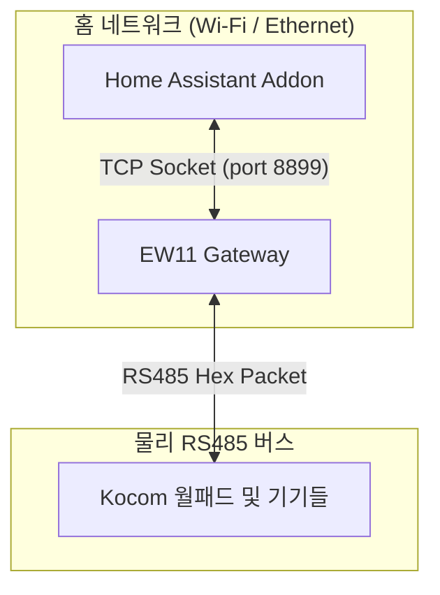
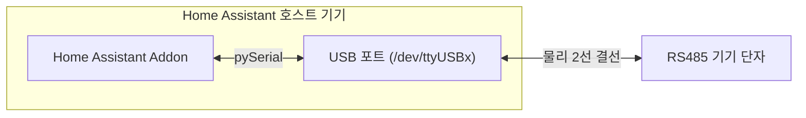
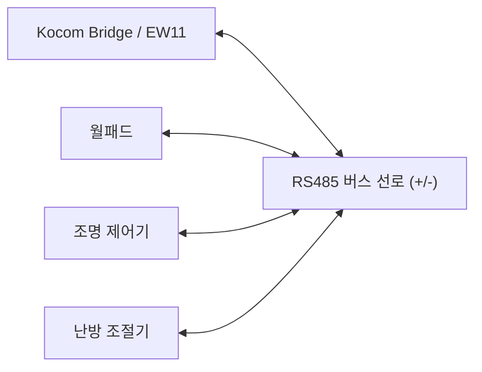
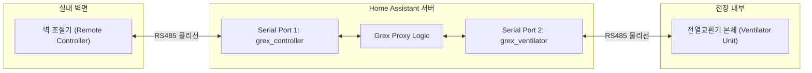

# RS485 하드웨어 연결 가이드

이 문서는 코콤(Kocom) 홈네트워크와 그렉스(Grex) 환기장치의 RS485 하드웨어 결선 방식(Socket vs Serial, Bus vs Proxy)을 설명합니다.

---

## RS485 통신 연결 방식 비교 (Socket vs Serial)

이 프로젝트는 Home Assistant(HA)가 구동되는 호스트 기기(라즈베리 파이, 미니 PC 등)와 RS485 버스 간의 통신 방식을 두 가지로 지원합니다.

### 소켓 방식 (Socket Mode - EW11 등 사용)
Wi-Fi to RS485 게이트웨이(예: Elfin-EW11)를 하드웨어 단에 설치하여 무선으로 데이터를 릴레이하는 방식입니다.

* **물리 결선**: 월패드 통신선 ➡️ EW11 (RS485 단자)
* **네트워크**: EW11 ↔ 공유기 (Wi-Fi) ↔ Home Assistant 호스트 (IP 네트워크)
* **특징**:
  * HA 서버와 월패드가 물리적으로 멀리 떨어져 있어도 Wi-Fi망을 통해 원격으로 제어가 가능합니다.
  * 애드온 코드는 지정된 IP와 포트로 TCP 소켓(`socket.socket`)을 열어 데이터를 송수신합니다.
  * ⚠️ **한계**: 현재 애드온 코드는 **Kocom 기기에 대해서만 Socket 모드를 지원**합니다. (Grex는 다중 포트 및 프록시 처리가 필요하여 현재 Socket 연동이 지원되지 않습니다.)

### 시리얼 방식 (Serial Mode - USB to RS485 사용)
USB to RS485 변환 동글을 Home Assistant 호스트 기기에 직접 꽂아 유선으로 연결하는 방식입니다.

* **물리 결선**: 기기 통신선 ➡️ USB to RS485 동글 ➡️ HA 호스트 기기 USB 포트
* **특징**:
  * 유선 연결이므로 무선(Wi-Fi) 장애로부터 자유롭고 지연 속도가 낮아 매우 안정적입니다.
  * 애드온 코드는 OS에 등록된 시리얼 장치 파일(예: `/dev/ttyUSB0`)을 열어 통신합니다.
  * **Kocom과 Grex를 동시에 구동할 때 필수적으로 사용되는 방식**입니다.

---

## 기기별 하드웨어 결선 아키텍처 (Kocom vs Grex)

Kocom과 Grex는 통신 선로를 구성하는 방식이 완전히 다릅니다.

### Kocom: 버스(Bus) 토폴로지
코콤 홈네트워크는 모든 기기(조명, 난방, 가스, 엘리베이터 등)가 하나의 RS485 통신선(Bus)을 공유하는 형태입니다.

* **동작 방식**:
  * 선로 위의 모든 패킷이 모든 장치에 전달되며, 각 장치는 패킷 내부의 ID(Address)를 보고 본인 것만 처리합니다.
  * 따라서 **단 1개의 통신 포트**(동글 1개 또는 EW11 1개)만 버스에 병렬로 묶어주면 전체 기기 제어 및 상태 모니터링이 가능합니다.

### Grex: 프록시 / 중간자(MITM) 토폴로지
그렉스 환기시스템은 **벽 조절기(Controller)**와 **천장 환기장치 본체(Ventilator)**가 1:1로만 직접 통신하는 구조입니다.

* **동작 방식**:
  * 단순히 선을 병렬로 따서 모니터링하는 것으로는 제어가 불가능합니다.
  * 따라서 벽 조절기와 본체 사이의 **기존 통신선을 절단**한 뒤, 애드온 호스트에 연결된 **2개의 시리얼 포트**에 각각 연결해야 합니다.
  * 애드온이 중간에서 데이터를 가로채서(MITM) 상대편에 전달하고, HA의 제어 명령이 오면 본체 패킷을 변조하여 송신하는 프록시(Proxy) 역할을 수행합니다.

