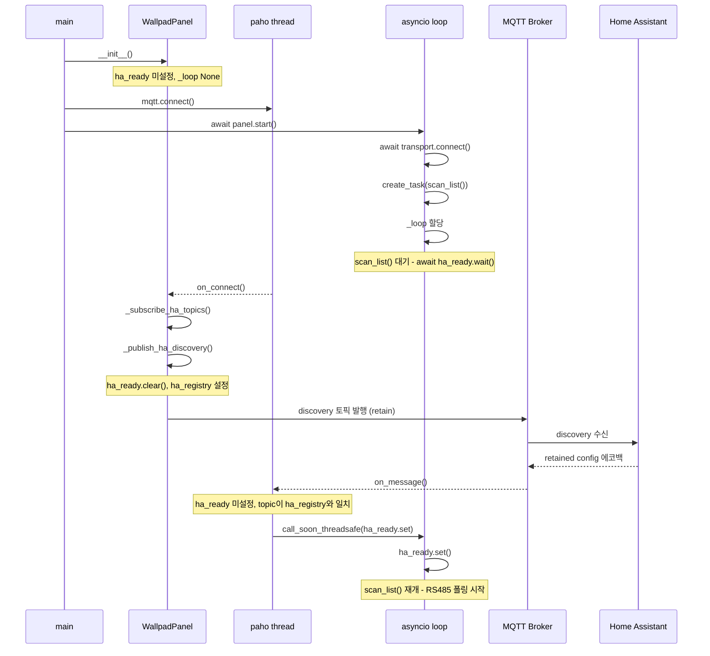
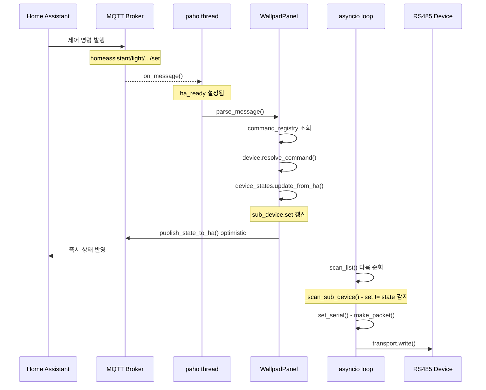
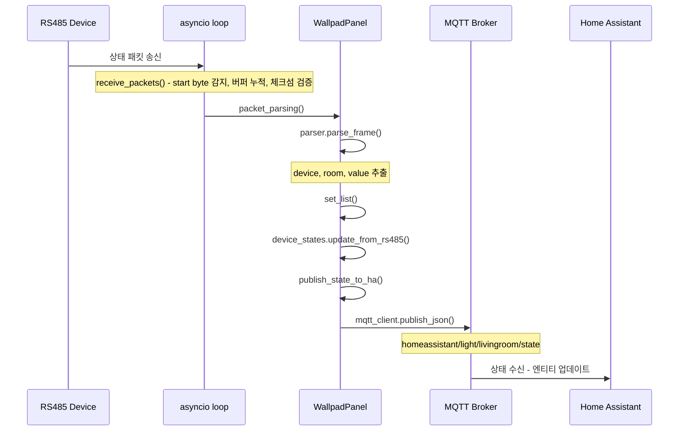

# 주요 시나리오 시퀀스 다이어그램

> **스레드 구분**
> - **paho thread**: MQTT 콜백(`on_connect`, `on_message`)이 실행되는 paho 내부 스레드
> - **asyncio loop**: `scan_list()`, `receive_packets()` 태스크가 실행되는 이벤트 루프 스레드

---

## 1. 초기화

브릿지는 HA가 discovery를 확인하기 전까지 제어 명령 처리와 RS485 폴링을 차단한다.
`ha_ready`(`asyncio.Event`)가 그 게이트 역할을 한다.

---

## 2. HA to Panel (제어 명령)

HA 제어 명령이 내려오면 `device_states`에 목표 상태를 기록하고,
`scan_list()` 다음 순회 시 RS485 패킷을 전송한다.

---

## 3. Panel to HA (상태 모니터링)

RS485 버스에서 패킷을 수신하면 파싱 후 HA에 상태를 발행한다.

